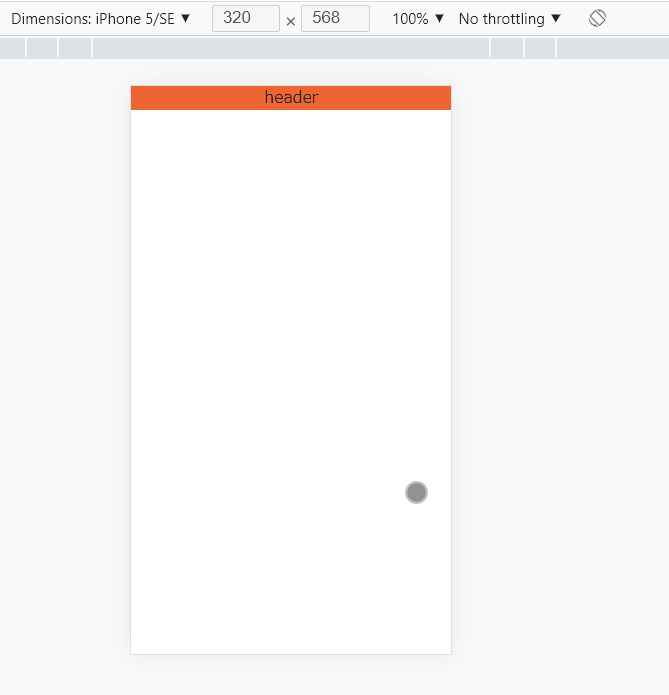
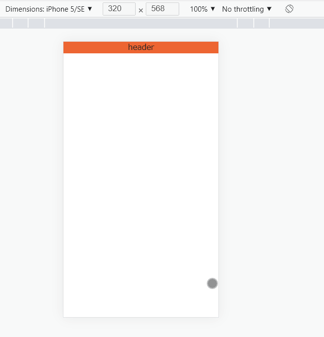

# demo

- https://github.com/mapbox/delaunator

- [Perlin_noise](https://en.wikipedia.org/wiki/Perlin_noise)
  - https://github.com/josephg/noisejs
  - https://www.npmjs.com/package/perlin-noise-3d
  - https://github.com/jwagner/simplex-noise.js
